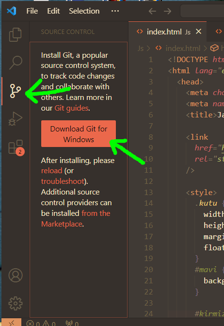

# GIT

- **GIT SCM Kurulumu**
  
  [https://git-scm.com/download/win](https://git-scm.com/download/win)
  
  - Next Next Diyip Kurulumu Bitir.
    
    cmd’ de linux kodlarımızı çalıştırabiliriz. Örneğin Burada Masaüstünde ‘’ test ‘’ adında bir dosya açıp, cmd üzerinden ‘’ code . ‘’ koduyla o dosya içinde Visiual Studio Code Açtık.
  ```csharp
  cd Desktop
  mkdir test
  cd test
  code .
  ```
- **GIT SCM Ne İşe Yarar?**
  
  
  - Çoğu Kişi Versiyonlanmaması gereken proje dosyalarını da versiyonluyor (commitliyor) örneğin log dosyaları password username dosyaları…vb.
    **Git ignore** özelliği ile versiyonlanmasını istemediğimiz dosyaları seçebiliriz.
- **GIT SCM En Çok Kullanılan Kodlar**
  - git init : projeyi oluştururken initealize etmek için kullanırız
  - git add . : **Yeni eklenen veya üzerinde değişiklik yapılan ’’ TÜM ‘’ dosyaları staged ortamına göndermek için kullanılır**. (gitignore dosyasındakiler hariç)
  - **git diff** : En son aldığımız snaphot’a kıyasla şuanki snapshot arasındakı değişiklikleri gösterir
    - **git diff HEAD** : Commitlenmiş ama henüz push edilmemiş dosyalarınız ile çalışma alanınız arasındaki farklara bakmak isterseniz
  - git commit : snapshot almak için kullanılır
  - git status : Proje de hangi dosyalarda değişiklik olduğunu öğrenmek için kullanırız
  - git push : uzak pc’ye veya github’a gönder
  - git pull : uzak pc’dem veya github’dan proje klasörünü çek
  - git clone [https://github.com/tahatan0/tahatan0.git](https://github.com/tahatan0/tahatan0.git) : projenin kopyasını klonunu almak için
  - git checkout : branch’ler arası geçiş yapabiliriz yani projenin içinde birden fazla kişi çalışıyor birden fazla yapı varsa bu branchler arası geçiş yapabiliyoruz
  - git rm : dosyaları siler
    - **git rm -r ‘’_klasör ismi_’’** : Eğer silmek istediğiniz bir dosya değil bir dizin ise
  - git log : projede hangi kullanıcı hangi saate ne commitlemiş loglarını gösterir
    - git log —oneline : daha az bilgi için (one line = tek satır)
    - git log —summary : daha fazla bilgi için (summary = özet)
  - **git checkout --index.html** : Bazı değişiklikler yaptınız ve sonra herhangi bir nedenden dolayı bu değişiklikleri kaydetmeden geri almak istiyorsunuz. Bu durumda kullanmanız gereken
  - **explorer .** : Dosyanın bulunduğu klasörü açar
  - **git —version** : git versiyonunu gösterir
  - **git branch** : tüm branch’larınızı listeler.
  - **git branch *yeni_branch_ismi :* Yeni bir branch olşturur**
  - **git checkout -b *yeni_branch_ismi :* Yeni bir branch olşturur ve o branch’e girer**
  - **git branch -d *branch_ismi : var olan bir branch’ı siler***
  - **git checkout _branch_ismi : branchler arası geçiş yapar_**
- **GIT**, **GitHub**, **GitLab**, **BitBucket**…vs
  [Gitlab Nedir? -](https://www.vargonen.com/blog/gitlab-nedir/)
  ## **GIT'i Anladım Fakat GitHub, GitLab, BitBucket Nedir?**
  En sade şekilde GIT versiyon kontrol sistemini kullanan depolama servisleri diyebiliriz.
  ### **GitHub**
  Yazılımcılar için bir kod kütüphanesi ve bir çeşit sosyal medya ortamıdır.
  Yazılım geliştiriciler projelerini halka açık veya özel olarak saklayabilir. Ücretli ve ücretsiz paket seçenekleri mevcuttur.
  ### **GitLab**
  GitHub gibi bir GIT servisidir. Farklı olarak firmalara GitLab'ı kendi sunucularına kurma imkanı verildiği için genelde kurumsal tarafta kullanılır. GitLab ile firmalar kendi içerisinde GIT hizmetlerinden faydalanabilir.
  ### **BitBucket**
  Genelde kişisel kullanıma yöneliktir. GitHub tarafındaki açık kaynak projeler ve sosyal medya ortamı burada gelişmemiştir.
  Yukarıda açıkladığımız servisler haricinde GitKraken, SourceTree gibi irili ufaklı farklı servisler de mevcuttur.
  GIT sistemini kullanmaya başladığınızda karşınıza daha önce aşina olmadığınız bazı tanımlar çıkacaktır. Temel bazı terimleri kısaca açıklayarak içeriğimizi bitirelim.
- **GIT Bash** ve **Git Temel Komutları**
  
  
  `git add -A .txt` komutunu çalıştırsaydık tüm .txt uzantılı dosyaları **staged** ortamına eklerdi.
  # **Değişiklikleri Commit’lemek**
  _Commit_, **staged** ortamına alınan dosyaların *HEAD*’e gönderilmesidir. Yapılan değişiklikler ***commit* sonucu hala sizin local’inizdedir** ve **uzak sunucuya gönderilmesi için push edilmesi gerekir.**
  - **Eğer İlk defa bir projeyi versiyon kontrol sistemine yani Git SCM e initialize ediceksek,
    git init komutunu kullanmalıyız.**
    
    
  - Proje klasörünün dosya yolunda yani içinde git bash açıldı
    
  - git init yazdık ve proje klasörümüzün içinde görünmeyen ‘’ .git ‘’ adında bir klasör açıldı, bu klasörün içerisindeki yapı GIT tarafından yönetiliyor. pek bi işimiz yok bu klasörle
    
    
  - Burada **git add index.html** diyerek bu dosyayı takibe (tracking) aldık.
    
  - Eğer yanlış dosyayı takibe aldıysak **git rm —cached index.html** yazarak bunu takipten çıkartabiliriz.
    veya **git reset** **index.html**
    `git reset` komutu dosyayı silmez. Sadece commit’lenmeye hazır durumda olma statüsünden çıkartır!
    
    
  - Eğer yaptığımız değişikliklerin snapshot’unu almak yani kaydetmek commit atmak istiyorsak;
    git commit -m ‘_Commit Hakkinda Yorum…vb_’
    
    **git diff** ile en son aldığımız snaphot’a kıyasla şuanki snapshot arasındakı değişiklikleri görüyoruz.
    a ile b arasındaki fark buna tekabül ediyor.
    **Not**
    
  - **M** : Modified
  - **U** : Untracked
    
  - git log : projede hangi kullanıcı hangi saate ne commitlemiş loglarını gösterir
    
    
- **Sırasıyla Push-Pull Etmek. (Düzenleniyor...)**
  
  
  
  ### Projeyi Push Etmek
  1. **git init** **→** Local Repository oluşturur. (Proje Klasörünün içinde .git klasörü)
  2. **git add \*** **→** Değişikliklerin hepsini, working dir’ den stage’ e atar.
  3. **git commit -m "_commit yorumu_”** **→** staged’ den *HEAD*’e gönderir.
  4. **git remote add origin** [https://github.com/tahatan0/tahatan0.git](https://github.com/tahatan0/tahatan0.git) **: Eğer** bir remote repository bağlantısı **yoksa** ssh ile (reponun url’si) bağlıyoruz.
  5. **git push -u origin master** **→** Burada bahsi geçen `origin` remote repository’nin kök dizinini belirtir ve sabit bir isimdir. `master` ise sizin çalıştığınız branch (dal)’ı belirtir. Branch’larınıza istediğiniz gibi isim verebilirsiniz.
  ***
  ### Projeyi Pull Etmek (Düzenleniyor…….)
  1.
  2. **git remote add origin** [https://github.com/tahatan0/tahatan0.git](https://github.com/tahatan0/tahatan0.git)
  3. **git pull origin master** veya **git pull**
  4.
  ### GIT Stash
  Çalışmalarımza devam ederken güncel dosyaları çekmek isteyebiliriz. Bu tarz durumlarda çakışma olmaması için`git stash` komutunu kullanarak çalışmakta olduğumuz dosyaları saklayabiliriz. Bu işlem *pull*’dan önce yapılmalıdır.
  Pull işlemi tamamlandıktan sonra tekrar çalışmalarımızı stash’den almak için ise  `git stash apply` komutu ile kaydedilmemiş çalışmalarımızı geri alabiliriz.
  ### GIT Merge
  Farklı bir branch’da çalışmamızı tamamladık ve artık bu branch’i projemize Dahil etmek istiyoruz. Bunun için `git merge branch_ismi` komutunu kullanabilirsiniz.
  ***
- **VS Code** **terminal kullanmadan GIT Temel Komutları**
  - Proje Klasörümüzü Açıyoruz.
    
  - Ardından ‘’Source Control’’ Menüsüne Geliyoruz ve ‘’**init**ialize Repository’’ diyoruz.
    
  - Gelen Ekranda Görüyoruz ki **stage edilmiş bir dosyamız yok**.
  - bir dosyayı stage etmek için + işaretine tıklıyoruz
    
  - Ardından stage edilmiş dosyalarımızı commit’lemek için bu kısma tıklıyoruz
    
  - Explorer Kısmına Geldiğimizde ise sadece index.html i eklenmiş, diğer dosyaları Untraccked (**U**) görürüz.
    
    
  - bir dosyada değişiklik yaptıktan sonra (**M**) Harfine tıklarsak, neler değiştirdiğimizi eskiye kıyasla görebiliriz.
    
  - Takip edilen Dosyalarda yapılan değişiklikleri eski haline geri getirebiliriz.
    
  - **Eğer** **remote repository'e bağlıysak** ve commit'lerimizi remote repository'e göndermek istersek **Views and More Actions (1)** butonuna tıklayıp, **Push (2)** seçeneğini seçmeliyiz.
- **.gitignore Dosyası Ne İşe Yarar?**
  - .gitignore dosyasının içerisinde yazmış olduğumuz dosyalar, dosya uzantıları, klasörler artık git tarafından takip edilmez. Untracked
  - Versiyon Kontrol Sisteminde Tutmamız Gerek Olmayan, Üstünde Sürekli Değişiklik Yapmadığımız, sabit duran dosya, video, görsel gibi elementleri tanımlar.
  - Herangi bir yazılım dili geliştirirken google’a :
    **react/.gitignore Yazarak, versiyonlanmasına gerek olmayan sabit dosyaları öğrenebiliriz.**
    
  - Kullandığımız Kod Editörünün de (IDE) değişmeyen, sürekli versiyonlanmaması gereken dosyaları olabilir :
    **Örneğin : Aşağıdaki Elemanları Versiyonlamak Gereksizdir.**
  - Görseller (!img)
  - Videolar
  - Logolar
  - Paket Yöneticisi İle Kurulmuş Dosyalar (**npm**)
  - Logs
  - IDE eklentileri
  - API anahtarları, kimlik bilgileri
  - • Çalışma dizinizdeki **geçici dosyalar**
  ### Nasıl Yapılır?
  - Proje’nin içerisinde bir dosya açıp adını ‘’.gitignore’’ yapıyoruz.
    
    
    
- **.gitignore** kaynaklar
  [](https://github.com/github/gitignore/tree/main/Global)
  [Ignoring files - GitHub Docs](https://docs.github.com/en/get-started/getting-started-with-git/ignoring-files)
  [How to Use a .gitignore File | Pluralsight](https://www.pluralsight.com/guides/how-to-use-gitignore-file)
  [Git - gitignore Documentation](https://git-scm.com/docs/gitignore)
  [Setting up a global .gitignore file](https://sebastiandedeyne.com/setting-up-a-global-gitignore-file/)
- **.gitignore kodları örnek**
  ## Neye dikkat etmeliyim?
  - Eğer projenizi `git add .` veya `git commit ` etmişseniz sonrasında `.gitignore` dosyasına eklemek istediğiniz dosyayı ekleseniz de bu işlem gerçekleşmeyecektir ve o dosyanız reponuzda hala GIT ile takip edilecektir. Tabi her şeyin bir çözümü olduğu gibi bu sorunu da çözmenin bir yolu var. İşte o çözüm .
    **```bash $ git rm --cached FILENAME**
  - **!files/example.txt :** Eğer ki bir klasörümüzü içerisindeki bir dosya haricinde izlenmesini istemiyorsak `!` işareti ile bunu sağlayabiliriz. Bu örnekte `files` klasörü içerisindeki `example.txt` haricindeki dosyalar izlenmeyecektir. Files klasörü içerisindeki sadece **example.txt** git akışında görülecektir.
    Eğer ki bir klasörümüzü içerisindeki bir dosya haricinde izlenmesini istemiyorsak `!` işareti ile bunu sağlayabiliriz. Bu örnekte `files` klasörü içerisindeki `example.txt` haricindeki dosyalar izlenmeyecektir. Files klasörü içerisindeki sadece **example.txt** git akışında görülecektir.
  - `#` : Yorum Satırı
  - **.log files/** _:_ `.log` uzantısına sahip dosyaların tümünü, ikinci örnekte ise `files` klasör içerisindeki bütün dosyaları izlemeyi bırakacaktır
  - **\*.dll** : ‘’.dll‘’ uzantılı tüm dosyalar.
- **.gitignore_global Dosyası**
  Her seferinde .gitignore dosyası yazmakla uğraşmak istemiyorsak örneğin VS Code’ un ignore’ları değişmez ve her projemizde bunları ignore dosyamıza eklemek istemiyorsak `.gitignore_global` dosyası oluşturmamız gerekir. İnternette Araştırarak Nasıl yapıldığını öğrenebiliriz.
- Branch Oluşturma, Timeline…vs
  
  
  
  - Timeline’ı açarak bu şekilde daha önceki commitlere yani snapshotlara bakabiliriz.
  ## Branch Oluşturma
  
  
  - Sol altta daha önce master yazıyordu, şimdi loginForm adlı oluşturduğumuz dizindeyiz yani branchteyiz (loginForm Workspace’i)
    
  - üstüne tıklarsak yine master’a geçiş yapabiliriz.
  - **git checkout _branch_ismi : branchler arası geçiş yapar_**
  ### Branch’imizi, Master’la birleştirme
  - **git checkout _master : Master’a geçiyoruz_**
  - **git merge _branch_ismi : alt branchimizin adını yazıyoruz_**
  - Master branchindeyken, xxx branchinde yapılan değişiklikleri görmek istiyorsak, ilgili dosyada **git merge _branch_ismi yazmamız gerekiyor_**
- **GitHub’a** Projemizin Eklenmesi
  
  - Github’dan bir repository oluşturuyoruz.
  - Visual Studio Code’ a gelip terminalde Şunları Yazıyoruz
  1. **git init**
  2. **git commit -m “first commit”**
  3. **git branch -M main**
  4. **git remote add origin https://github.com/tahatan0/tahatan0.git**
  5. **git push -u origin main**
     
  - commit islemini yaptiktan sonra VS Code penceresinin en sol altinda Push-Pull Etmek Icin bir bolum var bu bolume tiklarsak ;
    
  - git push işlemi otomatik olarak yapılmıştır, artık githundaki repomuz güncellenmiştir
- **MarkDown** Nedir, Nasıl Kullanırız?
  - MarkDown 2004 yılından beri kullanılan bir standarttır.
    
    
    [Markdown Reference](https://commonmark.org/help/)
    README.md
  - .md uzantısın açılımı ‘’**mark down’**’ dur.
  # : h1
  ## : h2
  **-** : liste elemani
  **\*** : liste elemani
  _lorem ipsum_ : italic
  **lorem ipsum** : bold
  **_lorem ipsum_** : bold + italic
  [lorem ipsum](http://google.com) : link olusturma a href
  ! [lorem ipsum](https://picsum.photos/200/300) : Fotoğraf entegre etme.
  - ```python
    print("hello world")
    ```
  ````
  3 adet backtick aralarina yazdigimiz textler, yazilim dili olarak algilanip background coloru ve fontu degistirilir.
  - ```javascript
  functio helloWorld() {
  console.log("hello world")
  }
  ````
  ## .md Dosyaları VS Code içerisinde görüntüleme
  
  - Bu eklentiyi Yüklüyoruz.
    
  - .md uzantısıyla bir dosya açıp içerisini dolduruyoruz
    
  - ekranın sağ al kısımından MarkDown Yazısına Tıklıyoruz
    
    
  - Ardından CTRL + SHIFT + P ye tıklayarak açılan command panale MarkDown Open Preview Yazıyor ve tıklıyoruz.
    
    
  - ve artık vs code içerisinde bir pencerede .md uzantılı markdown dosyalarının nasıl göründüğünü görebiliyoruz.
    
  - Ornek Bir Sayfa MarkDown Sayfasi
- **GitHub Profile, README.md olusutrma**
  [GitHub Profile Readme Generator](https://rahuldkjain.github.io/gh-profile-readme-generator/)
  [Next Level GitHub Profile README (NEW 2022)(Markdown template) | Improve Your Github profiles](https://www.youtube.com/watch?v=G-EGDH50hGE)
- **Odev 1** Patika (MarkDown)
  
  

## Kaynaklar :

- [GitHub Profile Readme Generator](https://rahuldkjain.github.io/gh-profile-readme-generator/)

- [Git - Documentation](https://git-scm.com/doc)

- [](https://education.github.com/git-cheat-sheet-education.pdf)

- [GIT CLI ile Komut Komut Versiyonlama!](https://medium.com/fedeveloper/git-bash-ile-komut-komut-versiyonlama-a354efd3063f)
